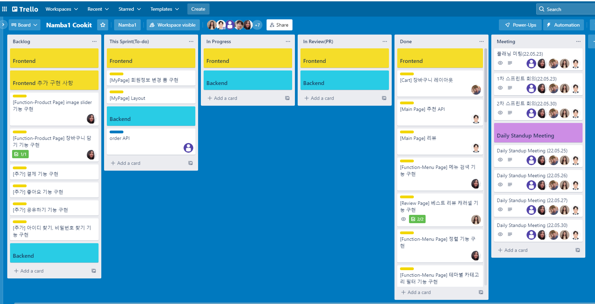

# &#x1f5a5;&#xfe0f; 홍길동의 포토폴리오

안녕하세요 저는 **프론트엔드 개발자**로, 웹과 모바일 기반 프로젝트를 통해 사용자 인터페이스를 설계하는 것을 전문으로 합니다.
이 포토폴리오에서는 저의 프로젝트, 경력, 및 기술 스택을 소개합니다.

---

## &#x1f3e2; 경력

| 회사명     | 기간      | 직책              | 주요 업무                             |
| ---------- | --------- | ----------------- | ------------------------------------- |
| ABC Corp   | 2020-현재 | 프론트엔드 개발자 | React 기반 웹 애플리케이션 개발       |
| XYZ Studio | 2018-2020 | 웹 디자이너       | 웹사이트 UX/UI 디자인 및 프로토타이핑 |

---

## &#x1f4bb;&#xfe0f; 주요 프로젝트

1. [프로젝트 A git링크](https://naver.com)

- **설명** : React와 Node.js를 사용한 소셜 미디어 플랫폼
- **주요 기능** : 사용자 프로필, 실시간 채팅, 게시물 관리 시스템

2. [프로젝트 B git링크](http://naver.com)

- **설명** : 온라인 쇼핑몰 플랫폼
- **주요 기능** : 상품 검색, 장바구니 시스템, 결제 처리

3. [블로그 프로젝트 git링크](http://naver.com)

- **설명** : 개인 블로그 및 기술 공유 플랫폼
- **기술 스택** : Jekyll, Markdown

---

## &#x1f6e0; 보유 기술

- **프론트엔드**: React, Vue, HTML/CSS. JavaScript
- **백엔드** : Node.js, Express, MongoDB
- **도구** : Git, Docker, Webpack, VSCode
- **클라우드** : AWS, Firebase

---

## &#x1f4de; 연락하기

- **이메일** : <honggildong@gmail.com>
- **GitHub** : <https://github.com/username>
- **LinkedIn** : <https://linkedin.com/in/username>

---

## &#x1f5bc; 프로젝트 이미지 (선택 사항)

_프로젝트 A의 예제 이미지입니다. (트렐로 일정관리) 다른 프로젝트에 대해서도 이미지를 추가해 보세요._

---

## &#x1f331; 추가 정보

저에 대해 더 궁금하시다면 위의 소셜 링크를 통해 연락주세요! 이 포트폴리오는 지속적으로 업데이트 될 예정입니다
